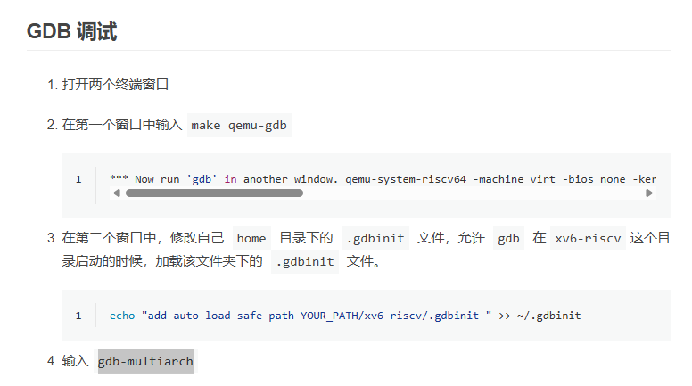

# 隔离性

隔离性是操作系统组织结构的驱动力

我们希望在操作系统下各个程序的内存是相互隔离的

我们希望在操作系统上可以管理程序实现Multiplexing


## 抽象硬件资源 abstracts the HW resources

进程抽象了cpu资源，操作系统向用户提供进程，而不直接提供cpu资源，用户只能与进程交互。这样os才可以对cpu进行时分复用。

exec抽象了内存资源，调用exec时传入的文件相当于一个内存镜像，包含了指令，数据等。进程也可以通过其它系统调用来扩展内存如sbrk。但是进程不能去直接与物理内存交互。
exec 系统调用会用指定的文件替换当前进程的地址空间，所以从用户角度看，它抽象了内存和程序镜像的加载过程。

file系统抽象了磁盘资源，程序不能去直接读写硬盘，但是可以通过文件系统读写文件。操作系统会决定如何将文件与磁盘中的块对应起来，并且设置不同用户的访问权限。

文件描述符(fd) unix进程之间的许多交互形式都是通过文件描述符发生，并且隐藏了许多细节。

---

CPU通常为强隔离性提供硬件支持。其中最重要的部分为，CPU应该支持user/kernel模式和虚拟内存。

## user mode和kernel mode

强隔离性需要应用程序和操作系统之间有硬边界。为了实现强隔离性，操作系统必须让应用程序不能读取操作系统的数据结构和指令，也不能访问其它的进程的内存。


CPU在Kernel mode时，CPU可以运行具有特殊权限的指令，如设置页表寄存器。
在user mode，CPU只能运行普通权限的指令，如ADD，ADDI，JAL等

 
## 虚拟内存

简单说，处理器中有一个东西叫页表，用来把虚拟的地址映射到物理地址。每一个进程都有各自的页表。并且每一个进程都只能访问出现在其页表中的物理内存地址。从而实现隔离性。

## 系统调用 system call

在实现了隔离性之后，我们的程序如何去将程序的控制权转移到内核，以便完成程序的功能。
解决方案是进行系统调用。
在riscV中有一个指令 ecall 它接受一个参数，用来确定是哪一种系统调用。

所以我们在用户层的系统调用，实际上不是直接调用函数的代码，而是通过ecall指令，告诉内核发生了系统调用。
内核一般会有一个系统调用的入口点，进入之后，会通过判断ecall的参数，来确定发生了某种系统调用，然后再调用对应的的函数。

## 宏内核与微内核 

哪些程序应该运行在kernel mode中？

### 宏内核 Monolithic Kernel Design 
将所有操作系统以及操作系统服务都运行在kernel mode中。这种内核被称为宏内核。
大多数Unix系统都是宏内核的。

优点：
所有的操作系统相关的部件/模块都运行在同一个程序中，它们可以紧密的集成在一起，提供更高的性能。
缺点：
内核中的代码量大，容易出现安全问题。

### 微内核 Micro Kernel Desgin
旨在减少内核中的代码，内核中只有非常少的模块。例如文件系统可能被当成一个常规的用户空间程序

优点：
内核中的代码少，不容易出现bug
缺点：性能问题
需要进行更多次的user/kernel mode的跳转。有更大的性能开销。
各个模块之间也有比较强的隔离性，所以进行高性能的共享会很困难。

# 代码演示部分笔记

XV6是个宏内核，所以kernel文件夹下所有的文件会被编译成一个叫kernel的二进制文件，然后这个文件被运行在kernel mode中。
所有的用户程序都被存放在user文件夹下。
mkfs，会创建一个空的文件镜像fs.img，可以让我们直接使用一个空的文件系统。这个fs.img会被qemu当作一个虚拟硬盘加载。

## 内核是如何编译的

gcc将.c文件编译成.s汇编语言文件，然后.s文件被汇编器翻译成.o二进制文件。
所有的文件被链接到一起，生成内核文件

## gdb查看运行过程

b _entry(在内核开始加载的位置打一个断点)
可以看到qemu来到了80000000的位置，开始加载操作系统
b main
可以看到qemu运行到了main函数，开始初始化一系列操作系统相关的东西。

在一系列初始化完成之后，通过运行userinit设置好第一个进程。

```c
void
userinit(void)
{
  struct proc *p;

  p = allocproc();
  initproc = p;
  
  // allocate one user page and copy init's instructions
  // and data into it.
  uvminit(p->pagetable, initcode, sizeof(initcode));
  p->sz = PGSIZE;

  // prepare for the very first "return" from kernel to user.
  p->trapframe->epc = 0;      // user program counter
  p->trapframe->sp = PGSIZE;  // user stack pointer

  safestrcpy(p->name, "initcode", sizeof(p->name));
  p->cwd = namei("/");

  p->state = RUNNABLE;

  release(&p->lock);
}
```

设置第一个用户进程（我们可以查看到它的PID == 1）
建议用户页表，然后将initcode拷贝到这一页。
然后对进程进行一些设置。
最后将进程的状态设置为RUNNABLE 表示进程可以被调度器选中运行。

关于initcode，是一个简单的汇编程序。

将init的地址加载到a0
将argv的地址加载进a1
exec对应的系统调用编号(7)加载进a7
然后ecall

```
# exec(init, argv)
.globl start
start:
        la a0, init
        la a1, argv
        li a7, SYS_exec
        ecall

# for(;;) exit();
exit:
        li a7, SYS_exit
        ecall
        jal exit

# char init[] = "/init\0";
init:
  .string "/init\0"

# char *argv[] = { init, 0 };
.p2align 2
argv:
  .long init
  .long 0

```

inituser()返回之后，进入scheduler函数。开始调度。

通过调度，会执行到刚刚我们手动加载进去的第一个用户进程的指令流initcode。
（gdb 中next了半天，但是一直在schedule中循环，明明有找到proc[0]是RUNABLE状态的??没有观察到怎么调度进去的。后面再说）
然后initcode的exec系统调用将我们的init程序的映像加载到该进程。
init程序在user/init.c中

init程序会进行一些设置，然后进行一次fork
fork出来的子进程exec启动shell，然后就算系统加载完成，我们可以通过shell进行交互。
父进程进行wait的循环。用于释放退出的孤儿进程的资源，或者释放刚刚的shell子进程的资源
(这个shell被释放后，父进程又会去fork新的子进程然后exec shell)


附：GDB启动有问题，从一个[blog]()找到了解决方案。
