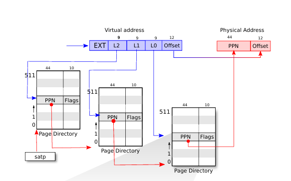
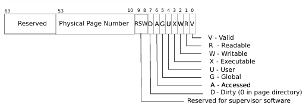

# Page Tables

隔离性是我们需要讨论虚拟内存的主要原因

## 地址空间

我们给所有的进程专属的地址空间
如何做到？

使用page tables

需要硬件支持，例如MMU（memory management unit） 

cpu执行指令时，例如从地址进行加载，其中的地址是虚拟地址，它会被转到mmu内，mmu将它翻译成物理地址，然后从物理地址拿回数据或写入数据。

MMU会查看一个表单(准确地讲并不是简单的表单)，这个表单一边存储虚拟地址，一边存储物理地址。

通常这个表单也存储在内存中，所以cpu需要有寄存器来存放表单在物理内存的地址。在riscv上，这个由SATP寄存器负责。

每一个程序都会有自己的表单，负责将虚拟地址翻译成物理地址。（mmu负责查看并翻译）

cpu在进行进程调度时，也要切换SATP寄存器（kernel负责且用户无权限）。

## page tables

显然的，如果地址映射的表单中为每一个地址都进行一个映射，那么这个表单将会巨大无比。

首先：不要为每一个地址都创建条目，而是为每一个page创建。
在riscv中，每一个page是4KB（大部分处理器都是）

对于虚拟地址，其中有（对于riscV的Sv39）
EXT[63:39]，25位暂时没用到，目前能表示512G(2^39Byte)内存
（对于riscV的物理内存，最大可以支持56bit的物理地址，但是Sv39只有39bit，所以无法映射所有的物理地址，能映射到的地址数量是小于物理内存最大范围的）
（如果Sv39可以映射的512G内存不够用，可以从这里继续扩展，如Sv48有四级页表，在此不再赘述）

index[38,12]，27位，用来查找存储在页表中的PTE(其中包含44位PPN和10位flag)(PPN即物理地址的高44位)

offset[11,0]，12位，用来表示page中的偏移，与page大小4KB对应。物理地址的第12位直接从此复制。

## page table 分级索引机制
然而，依然有非常多的条目需要存储。尤其是如果一个进程只使用了几页空间，那就会有非常多冗余的页表。
所以，我们采用一种分级的条目索引方法。

对于虚拟地址中[38,12]的27位，将其分为L2，L1，L0三段，一段9位

首先我们有一个page，是最高级的Page Directory
其中可以存储4KB/8Byte就是512个PTE
我们用L2拿到一个PPN，这个PPN指向的是中级的Page Directory
然后用L1在中级PageDirectory中拿到指向低级PageDirectory的PPN
然后用L0在低级PageDirectory中拿到目标物理地址所在的PPN

最高级的PageDirectory哪里来呢？ 前面提到的SATP寄存器会指向最高级的PageDirectory，每个cpu都会有不同的satp寄存器。

这样，我们就无需创建很多没有用到的条目了。
例如，原先我们需要对每一个page创建一个PPN条目。并且如果为空就valid为0。
一个valid只能表示一个page为空。
但是现在，高级page Directory中一个条目为空，就直接表示了512 * 512个PTE为空。无需创建它们的中级和低级的page Directory，就可以得知它们是空的。
这便是它可以在进程占用很小时，可以非常高效率的存储PTE条目的关键。

## PTE(Page Table Entry)的布局

**[63:54]预留,用于未来拓展**
**[53:10] PPN,44位，是56位的物理地址中的高44位(低12位直接由虚拟地址复制)**
**[9:0] 十位flag** 
valid：为1表示合法，告诉MMU可以用来翻译。
例如某个page Directory中没有存满PTE，没有用到的PTE的valid置0
readable
writable
executable表明你可以从这个page执行指令
user表明可以在用户模式下访问

后五个比较不常见这里不介绍。

所以，一次寻址，需要读取三次内存（MMU  硬件实现）。
为了提高效率，cpu会对于最近使用的虚拟地址的翻译有缓存，叫页表缓存 TLB(translation look-aside buffer)
TLB命中可以避免多次访问内存。
如果页表（SATP寄存器）进行了切换，操作系统需要知道TLB失效，清空TLB。(sfence_vma)

## page table提供了一层抽象

page table 为物理地址提供了封装，虚拟地址到物理地址的映射完全由内核控制。
所以，操作系统对于如何处理虚拟内存有着非常高的自由度，可以做一些灵活高级的操作。

