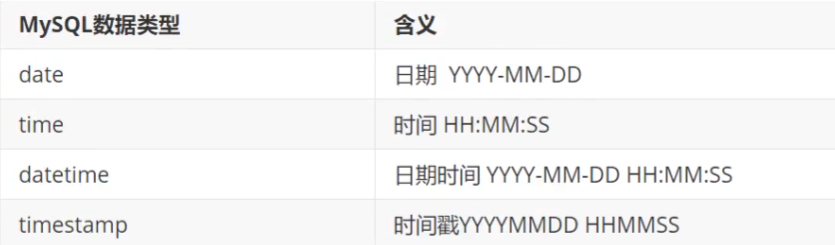

# 005-常用数据类型

MySQL提供了 整数类型 浮点数类型 字符类型 日期类型 二进制类型

## 整数类型
```SQL
--syntax:
INT [(m)] [unsigned] [zerofill]
--eg:
INT(3) unsigned zerofill
```

其中m只有在设置了zerofill时有用，是显示长度
例如实际值是2，m设置为3并设置zerofill。返回时会返回002


## 浮点数类型
```SQL
--syntax:
double(m,d)
--eg:
double(5,2)
```

其中m是总位数，d是小数位数。例如例子中为总共5位，小数占2位。


## 字符类型
char和varchar必须要设置长度。
char长度固定，不够空格补齐，存储空间固定。
varchar长度可变，设置的是最大长度。


查询速度 char>varchar>text

## 日期类型
timestamp在存储时转换成 UTF 0，可以做时区处理
另外datetime支持全部四位数的年份的所有时间。
timestamp 只支持1970年到2037年


## 二进制数据
BLOB(Binary Large Object)
以二进制存储，只能整体读出。
