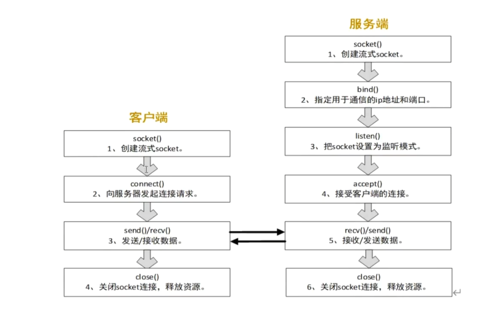

# 001



## client

### 创建client的socket
```cpp
    // int socket(int domain, int type, int protocol);

    int sockfd = socket(domain, type, protocol);
    if (sockfd == -1) {
        perror("socket err");
        return -1;
    }
```
关键函数：
```cpp
int socket (int __domain, int __type, int __protocol);
```
socket函数参数:
domain（地址族）：指定套接字使用的协议族（地址族），常见的选项有：
- AF_INET：IPv4 网络协议
- AF_INET6：IPv6 网络协议
- AF_UNIX（或 AF_LOCAL）：本地 UNIX 套接字（用于同一台机器进程间通信）

type(socket类型):指定socket 的通信方式，常见的选项有：
- SOCK_STREAM 面向连接的流式socket(TCP)
- SOCK_DGRAM 无连接的数据报socket(UDP)
- SOCK_RAW 原始套接字（用于直接访问IP层）

protocol(协议):可以指定为0，让系统自动选择
- IPPROTO_TCP（对于 SOCK_STREAM）
- IPPROTO_UDP（对于 SOCK_DGRAM）
- IPPROTO_ICMP（对于 SOCK_RAW）

返回值:
成功：返回一个socket文件描述符
失败：返回-1并设置errno

### 设置服务器地址结构
```cpp
    struct sockaddr_in servaddr;
    servaddr.sin_family = AF_INET; // 指定地址族（这里设置为IPv4地址族）
    // 指定端口号8080。htons用于将主机字节序(小端序，如Intel的CPU)转换为网络字节序（大端序）,网络协议规定必须使用大端序
    servaddr.sin_port = htons(8080); 

    // inet_pton 将点分十进制的IP地址转换成in_addr结构体
    // 参数(ip地址的格式,ip地址字符串,存储转换后的二进制ip地址)
    // 成功返回1,失败返回0,错误返回-1
    if (inet_pton(AF_INET,"127.0.0.1",&servaddr.sin_addr) <= 0) {
            perror("Invalid address/ Address not supported");
            close(sockfd);
            exit(EXIT_FAILURE);
    } 

    // 注：
    // 服务器地址结构体sockaddr_in, sin是socket internet前缀，互联网套接字地址，sin_ 前缀通常用于 sockaddr_in 结构体，专门用于 IPv4。后续使用可能要强制转换为struct sockaddr。
    // sockaddr_in 内部有sin_zero成员，用来填充长度，达到与sockaddr兼容
```


### 连接服务器
```cpp
    if (connect(sockfd,(struct sockaddr*)&servaddr,sizeof(servaddr)) == -1) {
        perror("Connection failed");
        close(sockfd);
        return -1;
    }
    // 注：仅TCP协议使用。UDP协议不是面向连接的
```
关键函数 
```cpp
int connect (int __fd, __CONST_SOCKADDR_ARG __addr, socklen_t __len);
```
参数：
- sockfd 客户端socket的文件描述符。
- addr 服务器地址结构体 
注：常用的可能是sockaddr_in,但是这里需要sockaddr，所以要经过强制转换。sockaddr_in内部对sockaddr做了兼容。
- addrlen 结构体的大小

返回值：
0 连接成功
-1 连接失败，并设置errno
和connect有关的常见的errno有：
* ECONNREFUSED	服务器拒绝连接（端口未监听）
* ETIMEDOUT	连接超时
* EHOSTUNREACH	无法到达目标主机
* EINPROGRESS	非阻塞模式下，连接仍在进行
* EADDRINUSE	本地地址已被占用

### 向服务器发送数据
```cpp
    const char* message = "hello!";
    send(sockfd,message,strlen(message),0);
```
关键函数：
```cpp
    ssize_t send (int __fd, const void *__buf, size_t __n, int __flags);
```
参数：
- sockfd 客户端的socket文件描述符。必须是已connect成功的TCP套接字。否则会报错ENOTCONN
- buf 发送的数据的缓冲区
- len 要发送的数据的长度
- flags 发送标志，一般为0
    - 0	默认模式，阻塞直到部分或全部数据发送
    - MSG_DONTWAIT	非阻塞发送，如果缓冲区满了，立刻返回
    - MSG_NOSIGNAL	阻止 SIGPIPE 信号，防止服务器断开导致程序崩溃
    - MSG_MORE	通知内核后续还有数据，减少 TCP 报文段

返回值：
* \>0	成功发送的字节数（可能小于 len，需继续发送）
* 0	对端已关闭（需要关闭 sockfd）
* -1	发送失败，错误码存于 errno


注：send的行为，只是从用户的缓冲区拷贝数据到内核的发送缓冲区，然后返回，send是不保证下层是否发送了数据包的。
另外对于阻塞和非阻塞的send，对于发送缓冲区大小不足有着不同的行为：

假如socket的文件描述符被设置为非阻塞方式，但是发送缓冲区没有足够空间容纳这个send所指示的应用层buffer的全部数据，那么能拷贝多少就拷贝多少，然后进程挂起，等待对端接收之前的发送，然后腾出空间之后，再由内核唤醒进程，继续拷贝。重复到拷贝完所有数据返回。

假如socket的文件描述符被设置为非阻塞方式，但是发送缓冲区没有足够空间容纳这个send所指示的应用层buffer的全部数据，那么能拷贝多少就拷贝多少，然后返回拷贝的字节数。
然后一般有两种后续处理：1、循环调用send。2，利用epoll或select。


### 接收服务器的响应
```cpp
int bytes_received = recv(sockfd, buffer, BUFFER_SIZE - 1, 0);
```
关键函数:
```cpp
ssize_t recv (int __fd, void *__buf, size_t __n, int __flags);
```
参数：
- sockfd：客户端套接字的文件描述符
- buf：存储接收数据的缓冲区指针。
- len：buf 的大小（最多能接收 len 字节）。
- flags：
    - 0：普通模式，默认行为。
    - MSG_PEEK：查看数据但不移出缓冲区。
    - MSG_OOB：接收带外（紧急）数据。
    - MSG_WAITALL：等待接收完整 len 字节（除非遇到 EOF 或信号中断）
返回值：
- \> 0：实际接收到的字节数（可能小于 len）。
- 0：对端关闭连接（TCP 连接断开）。
- -1：发生错误，错误码存储在 errno 中：
    - EAGAIN / EWOULDBLOCK：非阻塞模式下，没有数据可读。
    - EINTR：被信号中断，可以重试。
    - ECONNRESET：对方复位连接（连接被强制关闭）。

注：这里的len指的是最多接收的字节数。一般是用户缓冲区大小，无论是不是阻塞的，都不保证会读到len个字节。

### 释放资源，关闭socket
```cpp
    close(sockfd);
```
参数：fd socket的文件描述符
返回值：
- 0 成功
- -1 失败，并设置errno
    - EBADF：无效的文件描述符（可能已经被关闭）。
    - EINTR：close() 被信号中断（通常可以忽略）。
    - EIO：I/O 错误（很少见）。
