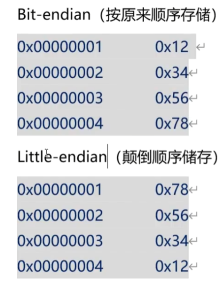

# 004

## 大端序与小端序

大端序是一种字节顺序方式，它将数据的高位字节存储在内存的低地址处，低位字节存储在内存的高地址处。

小端序是一种字节顺序方式，它将数据的低位字节存储在内存的低地址处，高位字节存储在内存的高地址处。



Intel的CPU以小端序保存数据。

字节序不同的计算机传输数据，可能有问题。

## 网络字节序

为了解决不同字节序传输问题，约定采用网络字节序（大端序）
库函数：htons htonl ntohs ntohl
(h是host，to，n是network，s是short，l是long)

## IP地址和端口
IPv4由4字节整数存放，一般用点分十进制表示。
端口由2字节存放。

## 网络编程如何处理大小端？
网络编程中，数据收发会自动转换。
但是在设定参数，对结构体成员变量进行数据填充时，需要考虑字节序问题。
例如对sockaddr_in结构体设置端口时
```cpp
server_addr.sin_port = htons(SERVER_PORT);
```

